# Domain Model — 숙박 예약 서비스

이 문서는 BE 서비스(`accommodation-booking-service`)의 도메인 모델 전체를 시각화한다.
Week1 ~ Week3 의 결정과 코드 베이스를 기준으로 작성되었으며, 모든 다이어그램은 Mermaid 로 표현되어 GitHub/IDE 에서 직접 렌더링된다.

---

## 1. 개요

도메인은 **3개의 Bounded Context** 로 분리되어 있고, 컨텍스트 간 통신은 **Kafka 도메인 이벤트** + **read-only Use Case 포트(in-port) 호출** 을 통해 이루어진다.
컨텍스트 간 직접 엔티티 참조는 없으며 모든 cross-context 식별자는 `Long` ID 또는 ID 스냅샷(`AccommodationSnapshot`, `RoomSnapshot`)으로만 전달된다.

| 컨텍스트 | 책임 | 핵심 Aggregate Root |
|----------|------|---------------------|
| **Booking** | 예약 주문 생성/상태 전이/취소·환불 오케스트레이션 | `BookingOrder` |
| **Accommodation** | 숙소·방 정보, 선점·취소 페널티 정책, 일정(차단/확정) 관리 | `Accommodation`, `Room` |
| **Transaction** | 결제 처리, 환불 원장(append-only) 관리, 결제 상태 전이 | `Transaction` |

---

## 2. Bounded Context Map

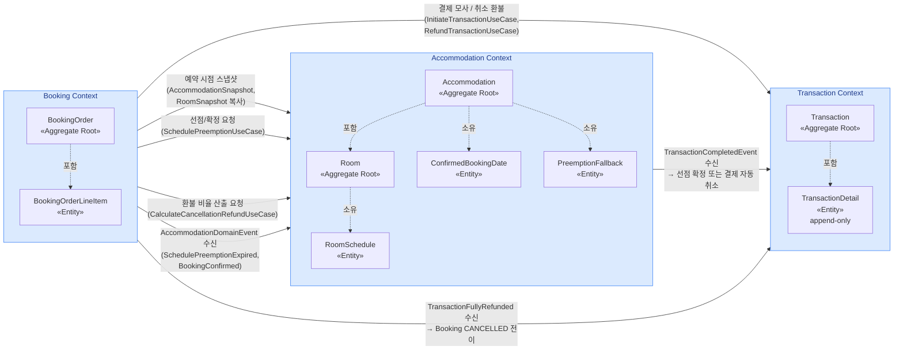

**경계 원칙**
- 컨텍스트 간 ID 참조만 허용 — `BookingOrderLineItem` 은 `accommodationId`, `roomId` 를 스냅샷 VO 로 들고 있을 뿐 Accommodation 엔티티를 직접 참조하지 않는다.
- Transaction 은 `Transaction.bookingOrderId` 로 Booking 을 식별 (역참조 X).
- Accommodation 의 `ConfirmedBookingDate` / `PreemptionFallback` 은 `bookingOrderId` 를 들고 있으나 Booking 엔티티 직접 참조 X.

---

## 3. Aggregate 클래스 다이어그램

### 3.1 Booking Context

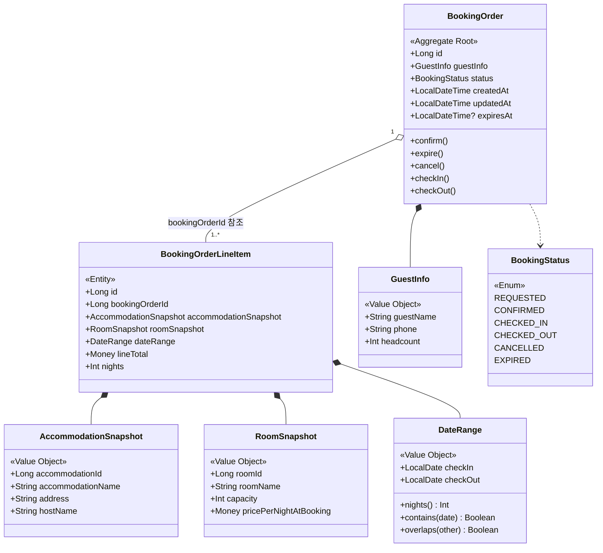

**불변조건** (`BookingOrder` 메서드가 보호):
- `취소된 예약은 재확정할 수 없다` — `confirm()` 이 `REQUESTED` 만 허용
- `체크인 이후 취소할 수 없다` — `cancel()` 이 `CHECKED_IN`/`CHECKED_OUT` 거부
- `체크인 없이 체크아웃할 수 없다` — `checkOut()` 이 `CHECKED_IN` 만 허용
- `만료된 예약은 확정할 수 없다` — `expire()` 후 `confirm()` 차단

### 3.2 Accommodation Context

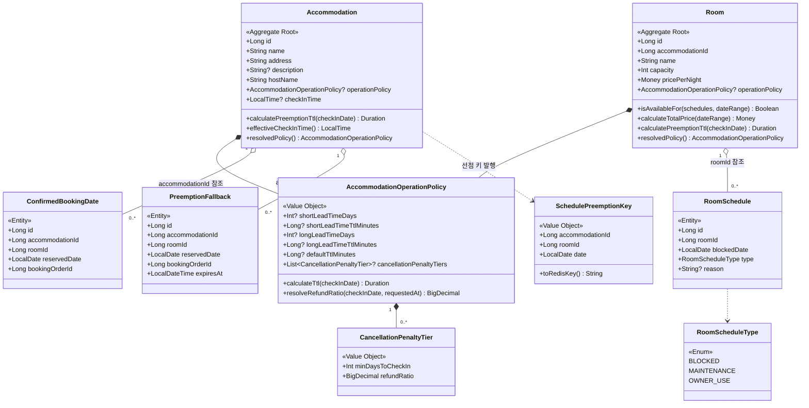

**핵심 정책**
- `AccommodationOperationPolicy.cancellationPenaltyTiers` 는 JSON 으로 직렬화되어 `cancellation_penalty_tiers TEXT` 컬럼에 저장 (`CancellationPenaltyTiersConverter`)
- `CancellationPenaltyTier.refundRatio` 는 `0.5 ~ 1.0` 강제 (페널티 최대 50% 불변조건)
- `ConfirmedBookingDate` 는 `(room_id, reserved_date)` Unique 로 더블 부킹 방지
- `PreemptionFallback` 은 Redis 장애 시 race 차단용 — 동일 unique constraint
- `RoomSchedule` 은 `(room_id, blocked_date)` Unique

### 3.3 Transaction Context

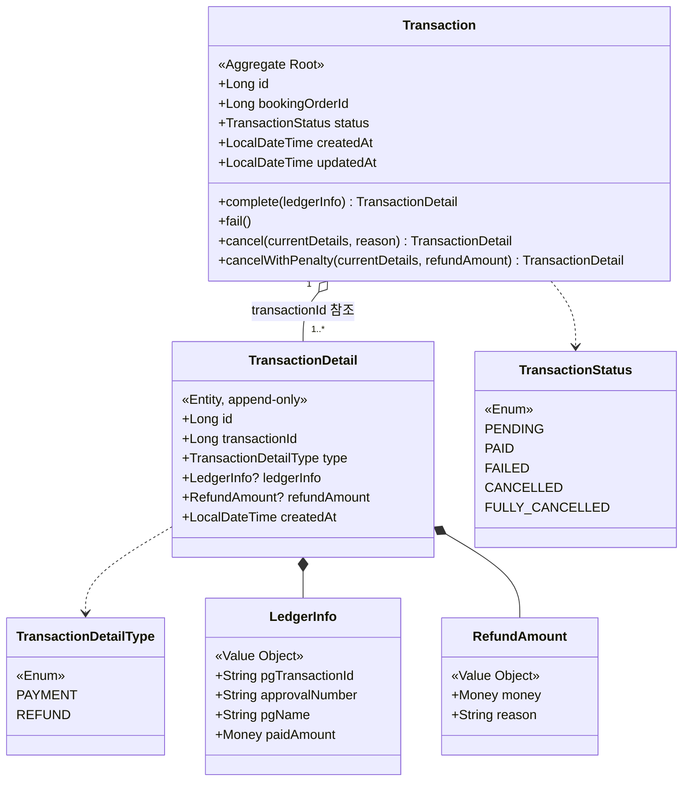

**불변조건** (`Transaction` 메서드가 보호):
- `TransactionDetail` 은 append-only — 생성 후 수정 금지
- `cancel(reason)` 은 `PAID` 상태에서만 → `CANCELLED` (시스템 자동 취소 경로)
- `cancelWithPenalty(refundAmount)` 는 `PAID` 상태에서만 → 즉시 `FULLY_CANCELLED` (고객 취소 경로, 한 번의 환불 row 추가)
- 페널티 잔액(= paidAmount − refundAmount) 은 호스트 몫으로 남고 추가 환불 발생하지 않음

---

## 4. 상태 전이 (State Diagrams)

### 4.1 BookingStatus

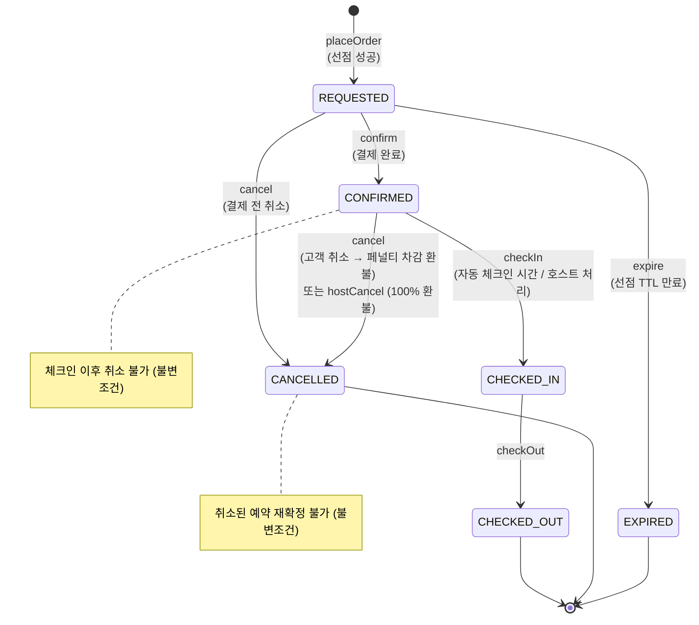

### 4.2 TransactionStatus

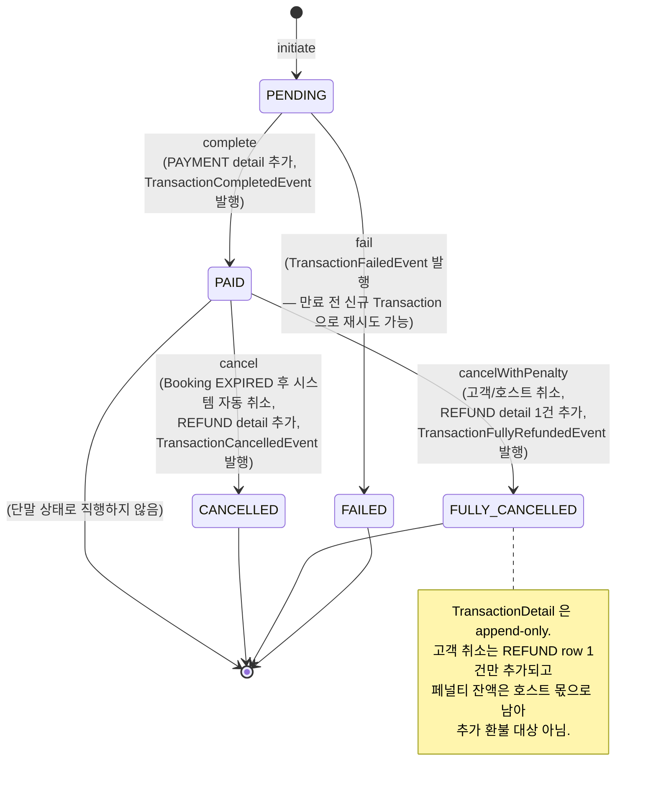

### 4.3 일정 상태 (Accommodation 일정 가시화)

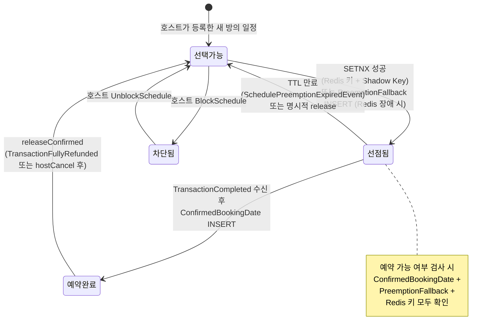

---

## 5. 도메인 이벤트

### 5.1 이벤트 목록

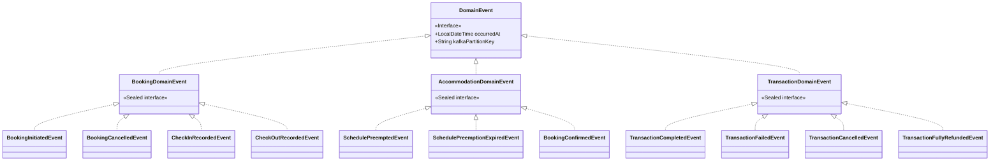

**Kafka 토픽 ↔ 이벤트 매핑**

| 토픽 (`KafkaTopics`) | 이벤트 | 발행 컨텍스트 | 수신 컨텍스트 |
|----------------------|--------|---------------|---------------|
| `booking.events` | `BookingInitiatedEvent` | Booking | (관찰자만) |
| `booking.events` | `BookingCancelledEvent` | Booking | (관찰자만) |
| `accommodation.events` | `SchedulePreemptionExpiredEvent` | Accommodation | Booking |
| `accommodation.events` | `BookingConfirmedEvent` | Accommodation | Booking |
| `transaction.events` | `TransactionCompletedEvent` | Transaction | Accommodation |
| `transaction.events` | `TransactionFailedEvent` | Transaction | (관찰자만) |
| `transaction.events` | `TransactionCancelledEvent` | Transaction | Booking (확인용) |
| `transaction.events` | `TransactionFullyRefundedEvent` | Transaction | Booking |

모든 이벤트의 `kafkaPartitionKey = bookingOrderId` → 동일 예약의 이벤트 순서 보장.

### 5.2 정상 시나리오 — 예약 → 결제 → 확정

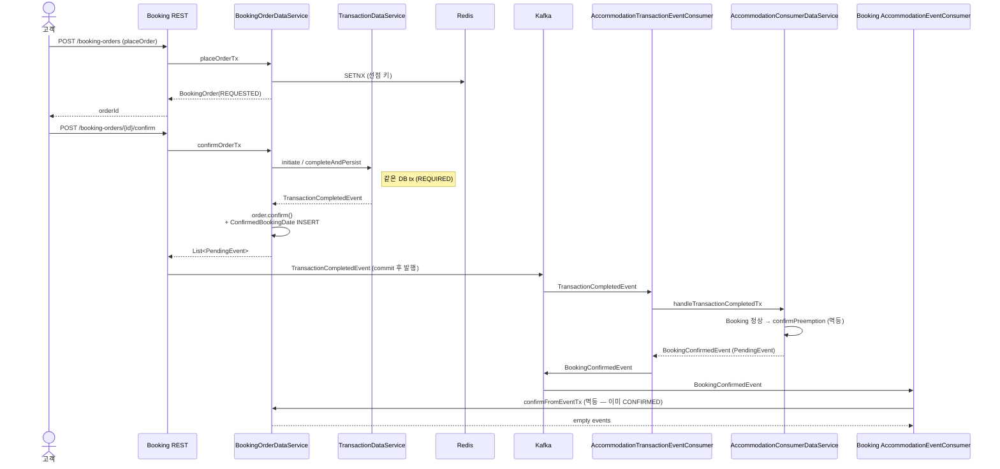

### 5.3 예외 시나리오 — TTL 만료 후 결제 도착

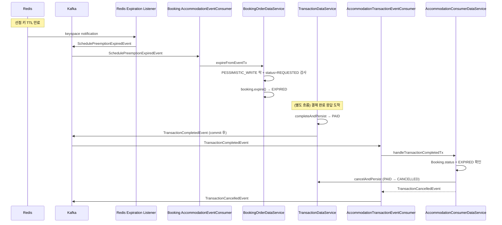

### 5.4 고객 취소 시나리오 — 페널티 차감 환불

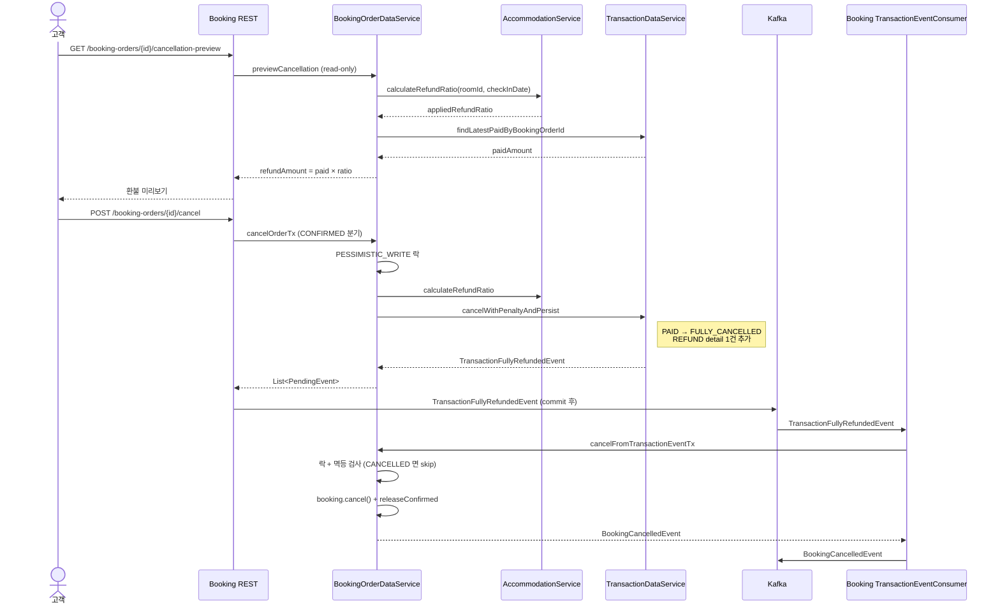

### 5.5 호스트 강제 취소 — 100% 환불

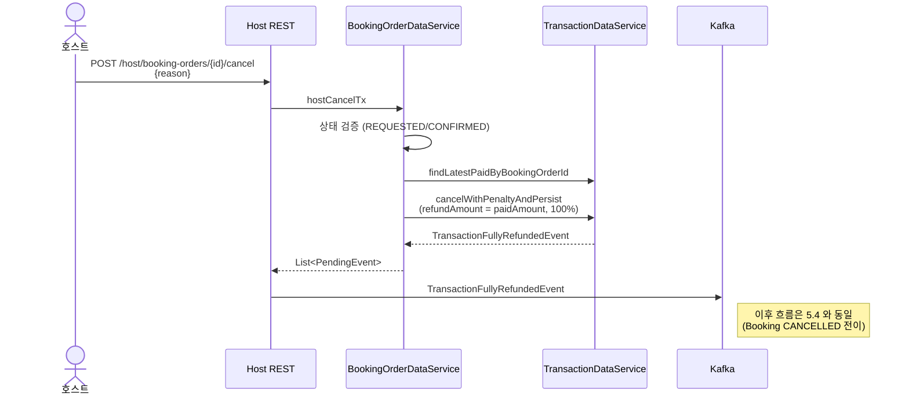

---

## 6. 데이터 무결성 보호 메커니즘 요약

| 메커니즘 | 대상 | 효과 |
|----------|------|------|
| `BookingOrder.{confirm/cancel/...}` 도메인 메서드 require | 상태 전이 | 불변조건 (체크인 후 취소 불가 등) 강제 |
| `Transaction.{cancel/cancelWithPenalty}` 도메인 메서드 require | 환불 처리 | PAID 외 상태에서 호출 차단 |
| `TransactionDetail` append-only | 환불 원장 | 이력 변조 차단 |
| Redis SETNX | 선점 race 차단 | 동일 키 동시 점유 불가 |
| `ConfirmedBookingDate` Unique `(room_id, reserved_date)` | 더블 부킹 차단 | 결제 완료 일정 race 차단 |
| `RoomSchedule` Unique `(room_id, blocked_date)` | 호스트 차단 일정 | 동일 날짜 중복 차단 차단 |
| `PreemptionFallback` Unique `(room_id, reserved_date)` | Redis 장애 시 race 차단 | DB 폴백 경로의 동시 선점 방지 |
| `BookingOrderJpaRepository.findByIdForUpdate` (PESSIMISTIC_WRITE, 5초 timeout) | Booking Aggregate 동시성 | 컨슈머·REST 동시 호출 직렬화 |
| `TransactionJpaRepository.findByIdForUpdate` (PESSIMISTIC_WRITE, 5초 timeout) | Transaction Aggregate 동시성 | 결제 상태 전이 직렬화 |
| Kafka partitionKey = `bookingOrderId` | 이벤트 순서 | 동일 예약 이벤트 순차 처리 보장 |
| 컨슈머 status self-check (CANCELLED/EXPIRED 면 skip) | 이벤트 중복 수신 | 멱등 처리 |
| `@Transactional` DataService + plain Orchestrator 분리 (Q3-A) | dual-write | DB commit 후 Kafka publish 보장 |

---

## 7. 참고

- 컨텍스트 간 호출 포트는 `application/port/in/*UseCase.kt` 인터페이스에 정의됨
- 영속성 어댑터는 `adapter/out/persistence/*JpaRepository.kt`, `adapter/out/redis/*Adapter.kt` 에 위치
- Kafka 컨슈머는 `adapter/in/kafka/*Consumer.kt`, REST 컨트롤러는 `adapter/in/web/*Controller.kt`
- 헥사고날 아키텍처를 따라 도메인 ↔ 인프라 의존성을 인터페이스로 차단

---

문서 갱신 이력
- 2026-04-27: Week3 완료 시점 (`AccommodationOperationPolicy`, `cancelWithPenalty`, `PreemptionFallback`, 자동 체크인, 비관적 락, Q3-A 일관 적용 모두 반영)
